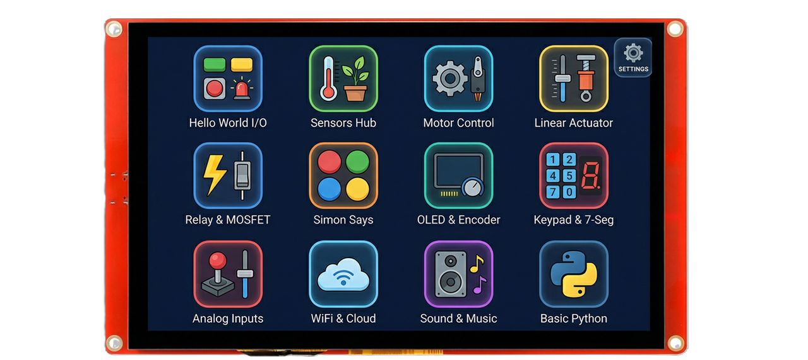

# SignalTwin ✨🧬

SignalTwin Display is a lightweight **HMI/visualization client** for exploring sensor data in real time 🖥️.
It focuses on **raw vs. processed comparisons**, **interactive inspection**, and **data capture** for later analysis
— while educational modules live *above* this layer (e.g., in EduBoxHub or external course content).

## 🧩 Target Hardware

SignalTwin Display is designed and tested for the **Elecrow ESP32 Display 7" HMI (ESP32-S3 + RGB TFT + Touch, LVGL-ready)**:

- 🔗 Distributor / purchase link:  
  https://www.elecrow.com/esp32-display-7-inch-hmi-display-rgb-tft-lcd-touch-screen-support-lvgl.html

---

## 🚀 Core Capabilities

### 🔎 Sensor Data Exploration
- 📊 Real-time visualization of **raw/real values** and derived/processed values (side-by-side comparison).
- 👀 Interactive browsing of streams and channels for quick inspection and debugging.
- 🌐 Designed as a generic viewer: **theoretically supports any sensor** as long as the upstream platform can provide it.

### 💾 Logging & Export
- 💽 Recording into **DataBundle** for structured capture sessions.
- 📝 Export to **CSV on SD card** for offline analysis (Python/Excel/Matlab workflows).

### 📚 Sensor Knowledge Base (Wiki)
- 📖 Built-in **Wiki** of sensors: quick reference for principles, typical ranges, pitfalls, and usage notes.
- ➕ Extensible content model (add new sensors without coupling to firmware logic).

---

## 🔗 Connectivity Model

SignalTwin Display does not read sensors directly in the general case.
It requires an upstream source that speaks our open protocol:

### 🔌 Supported Upstream Sources
- 🖥️ **PC connection (emulator / host tooling)**
- 🧩 **EduBoxHub** platform
- 🔧 **Custom hardware** implementing the same protocol

### 📡 Protocol: VSCP (Virtual Sensors Communication Protocol)
Communication is done via a **text-based, REST-like protocol**:

- 📚 Spec / reference repo: https://github.com/sgtkingo/VSCP

---

## ⚙️ Configuration & I/O (Bidirectional)

Beyond passive viewing, SignalTwin Display supports operational control via the upstream platform:

- 🔌 **Dynamic pin mapping**: set which physical pins a real sensor is connected to (runtime configuration).
- 🔁 **Bidirectional messaging**:
  - 📈 sensor reads (telemetry / streaming),
  - 🎚️ actuator control (sending values/commands),
  - 🛠️ configuration pushes (calibration, sampling, modes).

---

## 📖 Documentation

- 🧩 **Installation & deployment** are in **INSTALL.md** (toolchain, flashing, SD layout, emulator wiring).
- Recommended (optional) docs to add:
  - 🧱 `docs/ARCHITECTURE.md` — dataflow & message types (VSCP mapping)
  - 🗃️ `docs/FORMATS.md` — DataBundle + CSV schema
  - 📝 `docs/WIKI_GUIDE.md` — how to add/edit sensor Wiki entries

---

## 🧭 Typical Workflow

1. 🔗 Connect SignalTwin Display to **PC Emulator** or **EduBoxHub** (or a VSCP-capable custom device).
2. 🔎 Select a sensor/channel and inspect **raw vs. processed** outputs.
3. 💾 Record a session into **DataBundle** and export **CSV to SD**.
4. 📊 Analyze captured data offline (Python/Excel/Matlab).

---

## 🗂️ Repository Structure (Recommended)

- 🖼️ `ui/` — firmware + UI logic + .INO file (LVGL app)
- 📚 `libraries` — all headers and libraries (engine) 
- 🐍 `emulator` — Python-based emulator for testing
- 📄 `docs/` — diagrams, screenshots, Wiki sources
- 📦 `bin` — exported binary files
- 🧾 `data` — data files files (configurations, CSV)
- 📝 `RELEASE_NOTES` — latest release notes
- 📄 `LICENSE` — MIT

---

## 🐞 Troubleshooting 

- ❌ If you can connect but see no data: verify the upstream device speaks **VSCP** and is streaming the expected channels.
- 💽 If SD export fails: check card formatting and required folder structure (see `INSTALL.md`).

---

## 🤝 Contributing

Contributions are welcome, especially:
- 📈 additional visualizations (plots, trend views, event markers),
- 🧱 DataBundle/CSV improvements and schema stability,
- 📖 new sensor Wiki pages.

📨 Please include: device/source type (PC/EduBoxHub/custom), VSCP message example, and expected output.

---

## 📄 License

MIT — see `LICENSE`.