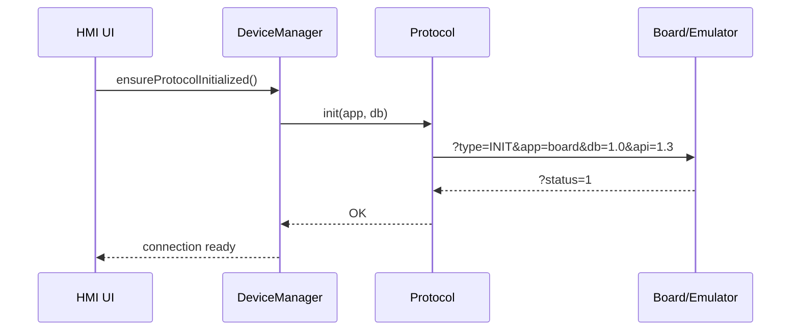
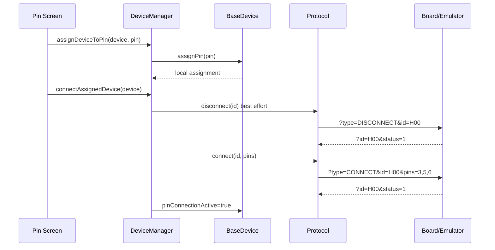
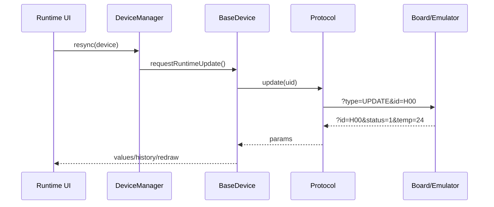
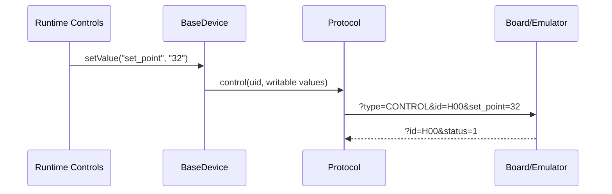

# VSCP Protocol

VSCP (Virtual Sensors Communication Protocol) je jednoduchý textový protokol pro komunikaci mezi HMI/firmwarem SignalTwin a cílovou deskou, reálným zařízením nebo emulátorem. Aktuální implementace projektu používá VSCP API `1.3`.

Protokol je request-response. HMI vždy odešle jeden command, protistrana odpoví jednou response zprávou. Runtime polling, configurace, control hodnoty i pin assignment jsou postavené nad stejným formátem.

## Umístění V Kódu

- Firmware protocol API: `libraries/vscp/src/protocol.hpp`, `libraries/vscp/src/protocol.cpp`
- UART transport: `libraries/vscp/src/io/messenger.cpp`
- Device integration: `libraries/engine/src/devices/base_device.hpp`
- Runtime orchestrace: `libraries/engine/src/managers/device_manager.cpp`
- Emulátor: `emulator/engine/emulator.py`
- Device katalog: `data/DB.json`, `ui/data/DB.json`

## Transport

Primární transport je UART.

Výchozí parametry ve VSCP vrstvě:

| Parametr | Hodnota |
| --- | --- |
| Baudrate | `115200` |
| Port | `UART1_PORT`, aktuálně `0` |
| RX/TX | `-1`, výchozí pin mapping platformy |
| Timeout běžného čtení | `100 ms` |
| Timeout INIT | `500 ms` |
| Line ending | Každá zpráva je ukončená `\n` |

`sendMessageAsString()` před odesláním zprávu očistí na tisknutelné ASCII znaky a trimuje whitespace. Zpráva se na UART posílá jako samostatný řádek. Na straně příjmu se čte přes `readStringUntil('\n')`.

Poznámka k logování: firmware může do stejného serial streamu zapisovat také `DEBUG`, `WARNING` a `EXCEPTION` logy. Emulátor tyto řádky filtruje a zpracuje jako firmware log, pokud neobsahují VSCP request. Pokud se log a request slepí do jednoho řádku, emulátor hledá první výskyt `?type=` a část před ním bere jako log.

## Wire Format

VSCP zpráva je URL-like query string:

```text
?key=value&key2=value2
```

Pravidla:

- Zpráva začíná znakem `?`.
- Páry jsou oddělené znakem `&`.
- Klíč a hodnota jsou oddělené prvním znakem `=`.
- Parser ignoruje položky bez `=`.
- Klíče nesmí být prázdné.
- Parser trimuje whitespace a netisknutelné znaky na okrajích klíčů a hodnot.
- Firmware parser je case-sensitive (`CASE_SENSITIVE true`).
- Všechny hodnoty jsou přenášené jako string.
- Aktuální firmware builder hodnoty neURL-encoduje. Nepoužívat proto `&`, `=` a neescapované whitespace v hodnotách.
- Emulátor při parsování response/request hodnoty URL-decoduje přes `urllib.parse.unquote`, ale firmware s encodingem obecně nepočítá.

## Stav Odpovědi

Každá odpověď obsahuje `status`.

| Hodnota | Význam |
| --- | --- |
| `status=1` | Command byl potvrzen jako úspěšný |
| `status=0` | Command selhal |

Při chybě se doporučuje přidat `error`.

```text
?id=S00&status=0&error=Device S00 not found
```

Firmware mapuje odpověď do:

```cpp
struct ResponseStatus {
    ResponseStatusEnum status; // OK nebo ERROR
    std::string error;
    std::unordered_map<std::string, std::string> params;
};
```

Pro většinu device commandů firmware vyžaduje, aby response obsahovala stejné `id`, jaké bylo v requestu. Pokud `id` chybí nebo nesedí, command selže jako UID mismatch.

Výjimka: `INIT` response nemusí obsahovat `id`.

## Device Model A Směr Dat

VSCP nerozlišuje typy dat na drátu. Typy, restrikce, access direction a pin definice jsou popsané v Device DB.

Relevantní části device JSON:

```json
{
  "uid": "H00",
  "role": "hybrid",
  "values": {
    "set_point": {
      "value": 25,
      "dtype": "int",
      "access": "write"
    },
    "temp": {
      "value": 20,
      "dtype": "int",
      "access": "read"
    }
  },
  "configs": {
    "speed": {
      "value": 2,
      "dtype": "int"
    }
  },
  "Pins": ["CTRL", "SENSE", "PWM"],
  "default": {
    "values": {
      "set_point": 25,
      "temp": 20
    },
    "configs": {
      "speed": 2
    },
    "pins": {
      "CTRL": 3,
      "SENSE": 5,
      "PWM": 6
    }
  }
}
```

Role:

| Role | Význam |
| --- | --- |
| `sensor` | Typicky používá `UPDATE` pro read values |
| `actuator` | Typicky používá `CONTROL` pro writable values |
| `hybrid` | Kombinuje `UPDATE`, `CONTROL` a případně `CONFIG` |

Value access:

| Access | Kanál |
| --- | --- |
| `read` | Hodnota se čte přes `UPDATE` |
| `write` | Hodnota se zapisuje přes `CONTROL` |

Configs jsou persistentní nebo setup parametry a posílají se přes `CONFIG`.

## Command Přehled

| Command | Request | Response | Účel |
| --- | --- | --- | --- |
| `INIT` | `?type=INIT&app=<app>&db=<version>&api=<api>` | `?status=1` | Handshake a ověření API/DB kompatibility |
| `CONNECT` | `?type=CONNECT&id=<uid>&pins=<csv>` | `?id=<uid>&status=1` | Připojí device k fyzickým pinům |
| `DISCONNECT` | `?type=DISCONNECT&id=<uid>` | `?id=<uid>&status=1` | Odpojí device od pinů |
| `UPDATE` | `?type=UPDATE&id=<uid>` | `?id=<uid>&status=1&key=value...` | Načte runtime read values |
| `CONFIG` | `?type=CONFIG&id=<uid>&key=value...` | `?id=<uid>&status=1` | Zapíše konfiguraci device |
| `CONTROL` | `?type=CONTROL&id=<uid>&key=value...` | `?id=<uid>&status=1` | Zapíše runtime output/control hodnoty |
| `RESET` | `?type=RESET&id=<uid>` | `?id=<uid>&status=1` | Resetuje device nebo runtime stav |

## INIT

INIT navazuje protokolové spojení. Firmware ho volá lazy, typicky při vstupu do cable connection flow nebo před prvním commandem, pokud protokol ještě není inicializovaný.

Aktuální plný request:

```text
?type=INIT&app=board&db=1.0&api=1.3
```

Povinné/volitelné parametry:

| Parametr | Povinný | Popis |
| --- | --- | --- |
| `type=INIT` | ano | Command type |
| `app` | doporučený | Název aplikace/katalogu, např. `board` |
| `db` | doporučený | Verze Device DB, např. `1.0` |
| `api` | ano pro aktuální flow | VSCP API verze, aktuálně `1.3` |

Úspěšná response:

```text
?status=1
```

Chybná response:

```text
?status=0&error=API mismatch - got 1.2, expected 1.3
```

Emulátor:

- Striktně kontroluje `api`, pokud je `strict_api=True`.
- Rozdílné `db` zatím pouze vypíše jako warning a v emulačním režimu přijme.
- Po úspěchu nastaví `initialized=True`.

Firmware:

- Opakuje INIT až `DeviceManager::MAX_INIT_ATTEMPTS`, aktuálně `5`.
- Mezi pokusy čeká `500 ms`.
- Pokud odpověď nemá `status=1`, protokol zůstane neinicializovaný.

## CONNECT

CONNECT potvrzuje skutečné připojení device k pinům na cílové straně. Pin selection v UI jen mění lokální mapu. Skutečné VSCP `CONNECT` se posílá až po kliknutí na Connect v pin screen.

Request:

```text
?type=CONNECT&id=H00&pins=3,5,6
```

Parametry:

| Parametr | Povinný | Popis |
| --- | --- | --- |
| `type=CONNECT` | ano | Command type |
| `id` | ano | Device UID z katalogu |
| `pins` | ano | Čárkou oddělený seznam fyzických pinů |

Úspěšná response:

```text
?id=H00&status=1
```

Chybná response:

```text
?id=H00&status=0&error=Pins 3,5,6 already used by device S00
```

Firmware validace před odesláním:

- Device musí mít vybrané všechny required pins.
- Počet required pins je odvozený z délky pole `Pins` v Device DB.
- Device nesmí mít vybráno víc pinů, než požaduje.
- `BaseDevice::getPins()` vrací fyzické piny v pořadí logických pinů z `Pins`.

Runtime state:

- Po úspěšném `CONNECT` se na device nastaví `pinConnectionActive=true`.
- Při změně pin assignmentu se `pinConnectionActive` zruší.
- Runtime visualization se spouští pouze pro zařízení s kompletním a potvrzeným pin connection.

Emulátor:

- Vyžaduje předchozí INIT.
- Kontroluje existenci UID.
- Kontroluje, že `pins` není prázdné.
- Parsuje piny jako int.
- Hlídá konflikt pinů mezi různými device.

## DISCONNECT

DISCONNECT odpojí device na cílové straně. UI lokální pin mapu smaže až po úspěšném potvrzení.

Request:

```text
?type=DISCONNECT&id=H00
```

Úspěšná response:

```text
?id=H00&status=1
```

Chybná response:

```text
?id=H00&status=0&error=Device H00 not found
```

Emulátor po úspěchu odstraní device z `connected_sensors`.

## UPDATE

UPDATE čte runtime values z device. Používá se pro values s `access=read`.

Request:

```text
?type=UPDATE&id=cpu_temp
```

Úspěšná response:

```text
?id=cpu_temp&status=1&temp=24.52
```

Příklad hybrid device:

```text
?type=UPDATE&id=H00
?id=H00&status=1&temp=22
```

Firmware:

- `BaseDevice::syncValues()` volá `Protocol::update(UID)`.
- Response parametry se zapisují do `Values`.
- Do `Values` se zapisují jen klíče, které existují v Device DB.
- Hodnoty se ukládají jako string a podle `dtype` se konvertují až při čtení nebo vykreslení.

Emulátor:

- Vrací pouze readable values.
- Writable values (`access=write`) v `UPDATE` payloadu nevrací.
- U `H00` modeluje postupné přibližování `temp` k `set_point`; rychlost ovlivňuje config `speed`.

## CONFIG

CONFIG zapisuje konfigurační parametry device. Je určený pro nastavení, které je konceptuálně konfigurace zařízení, ne runtime output hodnota.

Request:

```text
?type=CONFIG&id=H00&speed=4
```

Úspěšná response:

```text
?id=H00&status=1
```

Firmware:

- `BaseDevice::syncConfigs()` sestaví mapu ze všech `Configs`.
- `Protocol::config()` odešle všechny položky mapy jako query parametry.
- Po potvrzení `status=1` je config state považovaný za synchronizovaný.

Emulátor:

- Ukládá config hodnoty do `sensor_configs[uid]`.
- U `H00` `speed` ovlivňuje rychlost změny teploty směrem k `set_point`.

## CONTROL

CONTROL zapisuje runtime output/control values. Je určený pro hodnoty, které nejsou persistentní konfigurací, ale přímý výstup nebo požadovaná runtime veličina.

Request:

```text
?type=CONTROL&id=A00&Brightness=80
```

Úspěšná response:

```text
?id=A00&status=1
```

Příklad hybridního regulátoru:

```text
?type=CONTROL&id=H00&set_point=32
?id=H00&status=1
```

Firmware:

- `BaseDevice::syncControls()` posílá pouze values s `access=write`.
- CONTROL se používá pouze pokud device má writable values a role není `sensor`.
- Po potvrzení `status=1` je control state považovaný za synchronizovaný.

Emulátor:

- Kontroluje `_value_access`.
- Pokud request obsahuje value, která není writable, vrátí chybu.
- U writable values uloží stav do `control_values`.

Chybný příklad:

```text
?type=CONTROL&id=H00&temp=50
?id=H00&status=0&error=Values are not writable through CONTROL: temp
```

## RESET

RESET obnoví stav device nebo emulátoru.

Request:

```text
?type=RESET&id=H00
```

Úspěšná response:

```text
?id=H00&status=1
```

Speciální emulátorový request:

```text
?type=RESET&id=all
```

Ten vyčistí `sensor_configs`, `control_values` a `connected_sensors`.

## Typický Dataflow

### Cable Connection



### Pin Assignment A Connect



### Runtime Visualization



### Runtime Control



## Error Handling

Firmware Protocol layer neháže výjimky pro běžné protocol chyby. Vrací `ResponseStatus`.

Běžné důvody chyby:

- Protocol nebyl inicializovaný.
- UID je prázdné.
- Response neobsahuje `id`.
- Response `id` neodpovídá request UID.
- Response neobsahuje `status=1`.
- Response obsahuje `status=0`.
- Cílová strana vrátí `error`.

Device layer některé chyby převádí na device exceptions:

- `DeviceConnectionFailException`
- `DeviceSynchronizationFailException`
- `DevicePinAssignmentException`

Tyto výjimky se mají tisknout v catch handleru přes `Exception::print()`.

## Kompletní Příklady

### Sensor CPU Temp

```text
HMI -> HW: ?type=INIT&app=board&db=1.0&api=1.3
HW -> HMI: ?status=1

HMI -> HW: ?type=CONNECT&id=cpu_temp&pins=1
HW -> HMI: ?id=cpu_temp&status=1

HMI -> HW: ?type=UPDATE&id=cpu_temp
HW -> HMI: ?id=cpu_temp&status=1&temp=24.52

HMI -> HW: ?type=DISCONNECT&id=cpu_temp
HW -> HMI: ?id=cpu_temp&status=1
```

### Actuator PWM LED Driver

```text
HMI -> HW: ?type=INIT&app=board&db=1.0&api=1.3
HW -> HMI: ?status=1

HMI -> HW: ?type=CONNECT&id=A00&pins=3
HW -> HMI: ?id=A00&status=1

HMI -> HW: ?type=CONFIG&id=A00&Enabled=1
HW -> HMI: ?id=A00&status=1

HMI -> HW: ?type=CONTROL&id=A00&Brightness=80
HW -> HMI: ?id=A00&status=1
```

### Hybrid Temperature Regulator

```text
HMI -> HW: ?type=INIT&app=board&db=1.0&api=1.3
HW -> HMI: ?status=1

HMI -> HW: ?type=CONNECT&id=H00&pins=3,5,6
HW -> HMI: ?id=H00&status=1

HMI -> HW: ?type=CONFIG&id=H00&speed=4
HW -> HMI: ?id=H00&status=1

HMI -> HW: ?type=CONTROL&id=H00&set_point=32
HW -> HMI: ?id=H00&status=1

HMI -> HW: ?type=UPDATE&id=H00
HW -> HMI: ?id=H00&status=1&temp=24

HMI -> HW: ?type=UPDATE&id=H00
HW -> HMI: ?id=H00&status=1&temp=28

HMI -> HW: ?type=UPDATE&id=H00
HW -> HMI: ?id=H00&status=1&temp=32
```

## Implementační Poznámky

- `INIT` je jediný command bez povinného response `id`.
- `CONNECT` je potvrzený handshake pro pin assignment. Lokální UI assignment bez `CONNECT` nestačí pro runtime.
- `DISCONNECT` se používá před opětovným `CONNECT` jako best-effort cleanup.
- `UPDATE` by neměl vracet writable values, protože ty patří do `CONTROL`.
- `CONTROL` by měl přijmout jen writable values.
- `CONFIG` a `CONTROL` nemají vracet změněné hodnoty; stačí acknowledgement.
- Všechny hodnoty jsou stringy. Validace `dtype`, `min`, `max`, `step` je odpovědnost device modelu/UI nebo cílové implementace.
- Piny v requestu jsou fyzická čísla pinů, ne logické tagy. Logické tagy z `Pins` slouží pro UI a pořadí mapování.
- Pokud cílová implementace nezná device UID, má vrátit `status=0` a `error`.

## Aktuální Omezení

- Bez URL encodingu nejsou bezpečné hodnoty obsahující `&` nebo `=`.
- Protokol nemá checksum ani sequence id.
- Request-response je synchronní; paralelní requesty po stejném UART streamu nejsou podporované.
- Timeout handling je jednoduchý a odpověď bez řádku `\n` nebude přečtena.
- Wireless transport zatím není implementovaný.
