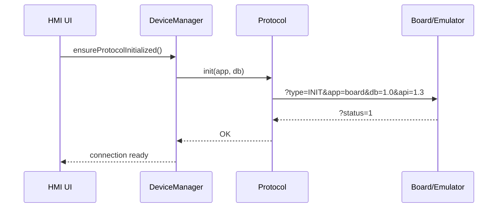
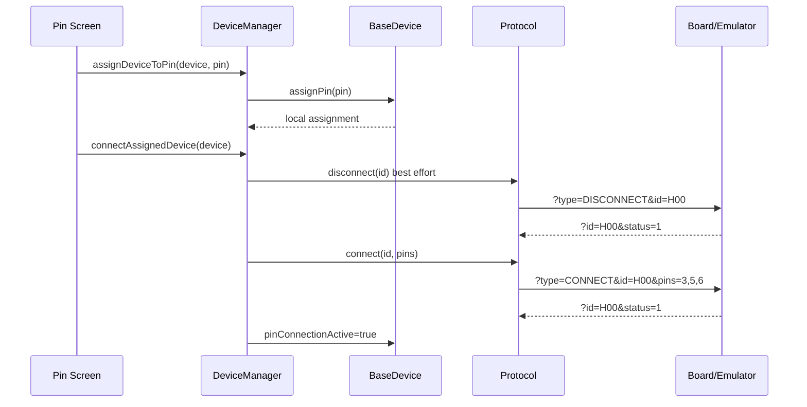
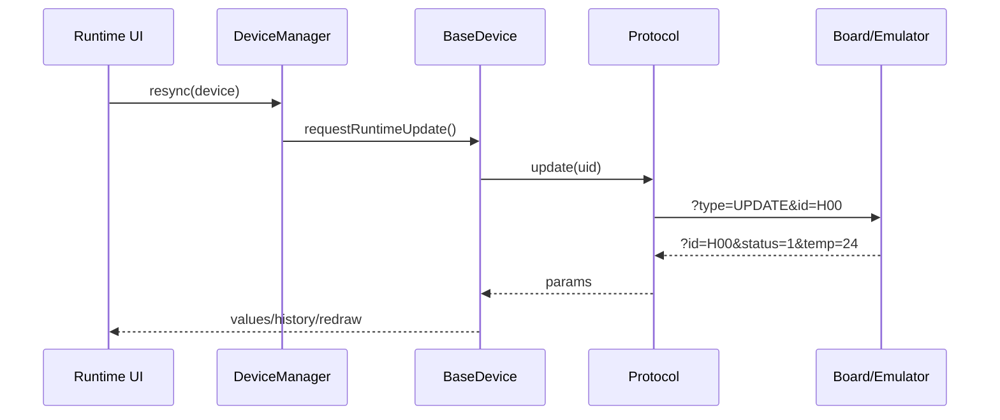
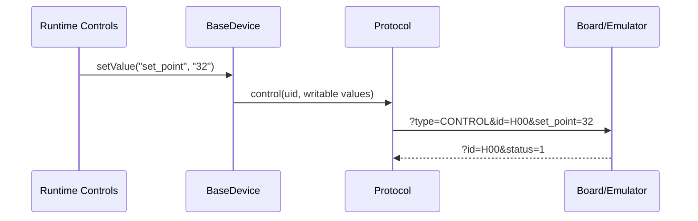

# VSCP Protocol

VSCP (Virtual Sensors Communication Protocol) is a simple text-based protocol for communication between the SignalTwin HMI/firmware and a target board, real device, or emulator. The current project implementation uses VSCP API `1.3`.

The protocol follows a request-response model. The HMI always sends one command, and the counterpart responds with one response message. Runtime polling, configuration, control values, and pin assignment are all built on the same format.

## Location in Code

- Firmware protocol API: `libraries/vscp/src/protocol.hpp`, `libraries/vscp/src/protocol.cpp`
- UART transport: `libraries/vscp/src/io/messenger.cpp`
- Device integration: `libraries/engine/src/devices/base_device.hpp`
- Runtime orchestration: `libraries/engine/src/managers/device_manager.cpp`
- Emulator: `emulator/engine/emulator.py`
- Device catalog: `data/DB.json`, `ui/data/DB.json`

## Transport

The primary transport is UART.

Default parameters in the VSCP layer:

| Parameter | Value |
| --- | --- |
| Baudrate | `115200` |
| Port | `UART1_PORT`, currently `0` |
| RX/TX | `-1`, platform default pin mapping |
| Standard read timeout | `100 ms` |
| INIT timeout | `500 ms` |
| Line ending | Each message is terminated by `\n` |

Before sending, `sendMessageAsString()` sanitizes the message to printable ASCII characters and trims whitespace. The message is sent over UART as a single line. On the receiving side, it is read using `readStringUntil('\n')`.

Logging note: the firmware may also write `DEBUG`, `WARNING`, and `EXCEPTION` logs to the same serial stream. The emulator filters these lines and processes them as firmware logs if they do not contain a VSCP request. If a log and a request are merged into one line, the emulator searches for the first occurrence of `?type=` and treats the part before it as a log.

## Wire Format

A VSCP message is a URL-like query string:

```text
?key=value&key2=value2
```

Rules:

- The message starts with the `?` character.
- Pairs are separated by the `&` character.
- The key and value are separated by the first `=` character.
- The parser ignores items without `=`.
- Keys must not be empty.
- The parser trims whitespace and non-printable characters from the edges of keys and values.
- The firmware parser is case-sensitive (`CASE_SENSITIVE true`).
- All values are transmitted as strings.
- The current firmware builder does not URL-encode values. Therefore, do not use `&`, `=`, or unescaped whitespace in values.
- When parsing request/response values, the emulator URL-decodes them using `urllib.parse.unquote`, but the firmware generally does not assume encoding.

## Response Status

Every response contains `status`.

| Value | Meaning |
| --- | --- |
| `status=1` | The command was acknowledged as successful |
| `status=0` | The command failed |

When an error occurs, adding `error` is recommended.

```text
?id=S00&status=0&error=Device S00 not found
```

The firmware maps the response into:

```cpp
struct ResponseStatus {
    ResponseStatusEnum status; // OK or ERROR
    std::string error;
    std::unordered_map<std::string, std::string> params;
};
```

For most device commands, the firmware requires the response to contain the same `id` as the request. If the `id` is missing or does not match, the command fails as a UID mismatch.

Exception: the `INIT` response does not have to contain `id`.

## Device Model and Data Direction

VSCP does not distinguish data types on the wire. Types, restrictions, access direction, and pin definitions are described in the Device DB.

Relevant parts of the device JSON:

```json
{
  "uid": "H00",
  "role": "hybrid",
  "values": {
    "set_point": {
      "value": 25,
      "dtype": "int",
      "access": "write"
    },
    "temp": {
      "value": 20,
      "dtype": "int",
      "access": "read"
    }
  },
  "configs": {
    "speed": {
      "value": 2,
      "dtype": "int"
    }
  },
  "Pins": ["CTRL", "SENSE", "PWM"],
  "default": {
    "values": {
      "set_point": 25,
      "temp": 20
    },
    "configs": {
      "speed": 2
    },
    "pins": {
      "CTRL": 3,
      "SENSE": 5,
      "PWM": 6
    }
  }
}
```

Roles:

| Role | Meaning |
| --- | --- |
| `sensor` | Typically uses `UPDATE` for read values |
| `actuator` | Typically uses `CONTROL` for writable values |
| `hybrid` | Combines `UPDATE`, `CONTROL`, and optionally `CONFIG` |

Value access:

| Access | Channel |
| --- | --- |
| `read` | The value is read via `UPDATE` |
| `write` | The value is written via `CONTROL` |

Configs are persistent or setup parameters and are sent via `CONFIG`.

## Command Overview

| Command | Request | Response | Purpose |
| --- | --- | --- | --- |
| `INIT` | `?type=INIT&app=<app>&db=<version>&api=<api>` | `?status=1` | Handshake and API/DB compatibility verification |
| `CONNECT` | `?type=CONNECT&id=<uid>&pins=<csv>` | `?id=<uid>&status=1` | Connects a device to physical pins |
| `DISCONNECT` | `?type=DISCONNECT&id=<uid>` | `?id=<uid>&status=1` | Disconnects a device from pins |
| `UPDATE` | `?type=UPDATE&id=<uid>` | `?id=<uid>&status=1&key=value...` | Reads runtime read values |
| `CONFIG` | `?type=CONFIG&id=<uid>&key=value...` | `?id=<uid>&status=1` | Writes device configuration |
| `CONTROL` | `?type=CONTROL&id=<uid>&key=value...` | `?id=<uid>&status=1` | Writes runtime output/control values |
| `RESET` | `?type=RESET&id=<uid>` | `?id=<uid>&status=1` | Resets the device or runtime state |

## INIT

`INIT` establishes the protocol connection. The firmware calls it lazily, typically when entering the cable connection flow or before the first command if the protocol has not yet been initialized.

Current full request:

```text
?type=INIT&app=board&db=1.0&api=1.3
```

Required/optional parameters:

| Parameter | Required | Description |
| --- | --- | --- |
| `type=INIT` | yes | Command type |
| `app` | recommended | Application/catalog name, for example `board` |
| `db` | recommended | Device DB version, for example `1.0` |
| `api` | yes for the current flow | VSCP API version, currently `1.3` |

Successful response:

```text
?status=1
```

Error response:

```text
?status=0&error=API mismatch - got 1.2, expected 1.3
```

Emulator:

- Strictly checks `api` if `strict_api=True`.
- A different `db` currently only prints a warning and is accepted in emulation mode.
- After success, it sets `initialized=True`.

Firmware:

- Repeats INIT up to `DeviceManager::MAX_INIT_ATTEMPTS`, currently `5`.
- Waits `500 ms` between attempts.
- If the response does not contain `status=1`, the protocol remains uninitialized.

## CONNECT

`CONNECT` confirms the actual connection of a device to pins on the target side. Pin selection in the UI only changes the local map. The actual VSCP `CONNECT` is sent only after clicking Connect on the pin screen.

Request:

```text
?type=CONNECT&id=H00&pins=3,5,6
```

Parameters:

| Parameter | Required | Description |
| --- | --- | --- |
| `type=CONNECT` | yes | Command type |
| `id` | yes | Device UID from the catalog |
| `pins` | yes | Comma-separated list of physical pins |

Successful response:

```text
?id=H00&status=1
```

Error response:

```text
?id=H00&status=0&error=Pins 3,5,6 already used by device S00
```

Firmware validation before sending:

- The device must have all required pins selected.
- The number of required pins is derived from the length of the `Pins` array in the Device DB.
- The device must not have more pins selected than it requires.
- `BaseDevice::getPins()` returns physical pins in the order of logical pins from `Pins`.

Runtime state:

- After a successful `CONNECT`, `pinConnectionActive=true` is set on the device.
- When pin assignment changes, `pinConnectionActive` is cleared.
- Runtime visualization starts only for devices with a complete and confirmed pin connection.

Emulator:

- Requires a previous INIT.
- Checks that the UID exists.
- Checks that `pins` is not empty.
- Parses pins as integers.
- Checks for pin conflicts between different devices.

## DISCONNECT

`DISCONNECT` disconnects the device on the target side. The UI clears the local pin map only after successful acknowledgement.

Request:

```text
?type=DISCONNECT&id=H00
```

Successful response:

```text
?id=H00&status=1
```

Error response:

```text
?id=H00&status=0&error=Device H00 not found
```

After success, the emulator removes the device from `connected_sensors`.

## UPDATE

`UPDATE` reads runtime values from the device. It is used for values with `access=read`.

Request:

```text
?type=UPDATE&id=cpu_temp
```

Successful response:

```text
?id=cpu_temp&status=1&temp=24.52
```

Hybrid device example:

```text
?type=UPDATE&id=H00
?id=H00&status=1&temp=22
```

Firmware:

- `BaseDevice::syncValues()` calls `Protocol::update(UID)`.
- Response parameters are written into `Values`.
- Only keys that exist in the Device DB are written into `Values`.
- Values are stored as strings and converted according to `dtype` only when read or rendered.

Emulator:

- Returns only readable values.
- Writable values (`access=write`) are not returned in the `UPDATE` payload.
- For `H00`, it models gradual convergence of `temp` toward `set_point`; the speed is affected by the `speed` config.

## CONFIG

`CONFIG` writes device configuration parameters. It is intended for settings that are conceptually device configuration, not runtime output values.

Request:

```text
?type=CONFIG&id=H00&speed=4
```

Successful response:

```text
?id=H00&status=1
```

Firmware:

- `BaseDevice::syncConfigs()` builds a map from all `Configs`.
- `Protocol::config()` sends all map items as query parameters.
- After `status=1` acknowledgement, the config state is considered synchronized.

Emulator:

- Stores config values in `sensor_configs[uid]`.
- For `H00`, `speed` affects the rate of temperature change toward `set_point`.

## CONTROL

`CONTROL` writes runtime output/control values. It is intended for values that are not persistent configuration but direct outputs or desired runtime quantities.

Request:

```text
?type=CONTROL&id=A00&Brightness=80
```

Successful response:

```text
?id=A00&status=1
```

Hybrid regulator example:

```text
?type=CONTROL&id=H00&set_point=32
?id=H00&status=1
```

Firmware:

- `BaseDevice::syncControls()` sends only values with `access=write`.
- `CONTROL` is used only if the device has writable values and its role is not `sensor`.
- After `status=1` acknowledgement, the control state is considered synchronized.

Emulator:

- Checks `_value_access`.
- If the request contains a value that is not writable, it returns an error.
- For writable values, it stores the state in `control_values`.

Error example:

```text
?type=CONTROL&id=H00&temp=50
?id=H00&status=0&error=Values are not writable through CONTROL: temp
```

## RESET

`RESET` restores the state of a device or emulator.

Request:

```text
?type=RESET&id=H00
```

Successful response:

```text
?id=H00&status=1
```

Special emulator request:

```text
?type=RESET&id=all
```

This clears `sensor_configs`, `control_values`, and `connected_sensors`.

## Typical Dataflow

### Cable Connection



### Pin Assignment and Connect



### Runtime Visualization



### Runtime Control



## Error Handling

The firmware Protocol layer does not throw exceptions for common protocol errors. It returns `ResponseStatus`.

Common error reasons:

- The protocol was not initialized.
- UID is empty.
- The response does not contain `id`.
- The response `id` does not match the request UID.
- The response does not contain `status=1`.
- The response contains `status=0`.
- The target side returns `error`.

The Device layer converts some errors into device exceptions:

- `DeviceConnectionFailException`
- `DeviceSynchronizationFailException`
- `DevicePinAssignmentException`

These exceptions should be printed in a catch handler using `Exception::print()`.

## Complete Examples

### Sensor CPU Temp

```text
HMI -> HW: ?type=INIT&app=board&db=1.0&api=1.3
HW -> HMI: ?status=1

HMI -> HW: ?type=CONNECT&id=cpu_temp&pins=1
HW -> HMI: ?id=cpu_temp&status=1

HMI -> HW: ?type=UPDATE&id=cpu_temp
HW -> HMI: ?id=cpu_temp&status=1&temp=24.52

HMI -> HW: ?type=DISCONNECT&id=cpu_temp
HW -> HMI: ?id=cpu_temp&status=1
```

### Actuator PWM LED Driver

```text
HMI -> HW: ?type=INIT&app=board&db=1.0&api=1.3
HW -> HMI: ?status=1

HMI -> HW: ?type=CONNECT&id=A00&pins=3
HW -> HMI: ?id=A00&status=1

HMI -> HW: ?type=CONFIG&id=A00&Enabled=1
HW -> HMI: ?id=A00&status=1

HMI -> HW: ?type=CONTROL&id=A00&Brightness=80
HW -> HMI: ?id=A00&status=1
```

### Hybrid Temperature Regulator

```text
HMI -> HW: ?type=INIT&app=board&db=1.0&api=1.3
HW -> HMI: ?status=1

HMI -> HW: ?type=CONNECT&id=H00&pins=3,5,6
HW -> HMI: ?id=H00&status=1

HMI -> HW: ?type=CONFIG&id=H00&speed=4
HW -> HMI: ?id=H00&status=1

HMI -> HW: ?type=CONTROL&id=H00&set_point=32
HW -> HMI: ?id=H00&status=1

HMI -> HW: ?type=UPDATE&id=H00
HW -> HMI: ?id=H00&status=1&temp=24

HMI -> HW: ?type=UPDATE&id=H00
HW -> HMI: ?id=H00&status=1&temp=28

HMI -> HW: ?type=UPDATE&id=H00
HW -> HMI: ?id=H00&status=1&temp=32
```

## Implementation Notes

- `INIT` is the only command without a mandatory response `id`.
- `CONNECT` is the confirmed handshake for pin assignment. A local UI assignment without `CONNECT` is not sufficient for runtime.
- `DISCONNECT` is used before reconnecting as best-effort cleanup.
- `UPDATE` should not return writable values, because those belong to `CONTROL`.
- `CONTROL` should accept only writable values.
- `CONFIG` and `CONTROL` do not have to return changed values; acknowledgement is sufficient.
- All values are strings. Validation of `dtype`, `min`, `max`, and `step` is the responsibility of the device model/UI or target implementation.
- Pins in the request are physical pin numbers, not logical tags. Logical tags from `Pins` are used by the UI and for mapping order.
- If the target implementation does not recognize the device UID, it should return `status=0` and `error`.

## Current Limitations

- Without URL encoding, values containing `&` or `=` are not safe.
- The protocol has no checksum or sequence ID.
- Request-response is synchronous; parallel requests over the same UART stream are not supported.
- Timeout handling is simple, and a response without a `\n` line ending will not be read.
- Wireless transport is not implemented yet.
