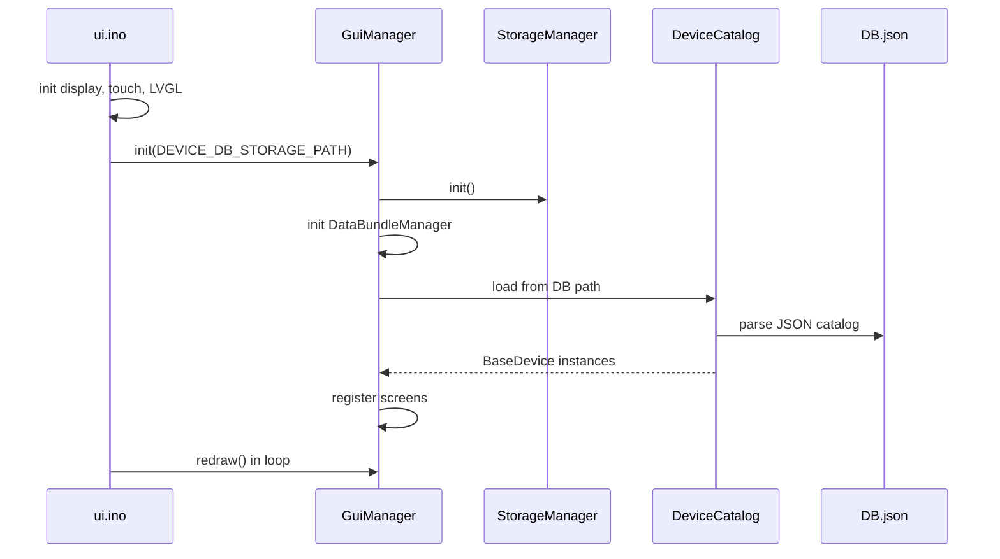
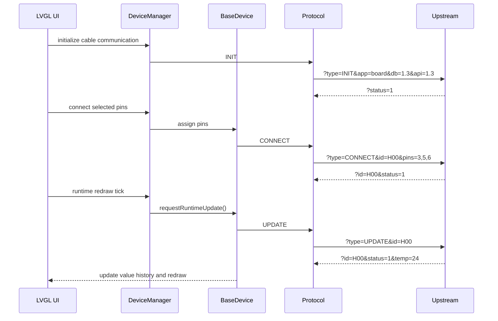

# SignalTwin Architecture Notes

This document is a compact architectural reference for SignalTwin Display. For the full developer map, see [DEV_MAP_EN.md](../dev/DEV_MAP_EN.md). For the wire protocol, see [PROTOCOL_EN.md](../PROTOCOL_EN.md).

## Scope

SignalTwin Display is an ESP32-S3 LVGL HMI for viewing, controlling, and recording device data. It does not own the physical sensor logic in the general case. Instead, it loads a local device catalog, lets the user choose devices and pins, and talks to an upstream endpoint through VSCP.

Supported upstream endpoints:

- Python emulator in [`emulator/`](../../emulator/)
- EduBox HUB or another compatible board
- Custom hardware implementing the same VSCP request-response protocol

## System Overview

```text
User
  -> LVGL GUI
  -> GuiManager / screen registry
  -> DeviceManager / DeviceCatalog / DataBundleManager
  -> BaseDevice runtime model
  -> VSCP Protocol
  -> UART transport
  -> emulator, EduBox HUB, or custom hardware
```

The firmware side is built from the Arduino sketch in [`ui/ui.ino`](../../ui/ui.ino). Application logic lives mostly in [`libraries/engine`](../../libraries/engine/), while VSCP transport and message formatting live in [`libraries/vscp`](../../libraries/vscp/).

## Main Components

| Component | Main path | Responsibility |
| --- | --- | --- |
| Arduino sketch | [`ui/ui.ino`](../../ui/ui.ino) | Board, display, touch, LVGL, global managers, main loop. |
| GUI manager | [`libraries/engine/src/gui/gui_manager.cpp`](../../libraries/engine/src/gui/gui_manager.cpp) | Startup, navigation, redraw loop, screen ownership. |
| Screen registry | [`libraries/engine/src/gui/gui_screen_registry.cpp`](../../libraries/engine/src/gui/gui_screen_registry.cpp) | Creates and switches GUI screens. |
| Device catalog | [`libraries/engine/src/managers/device_catalog.cpp`](../../libraries/engine/src/managers/device_catalog.cpp) | Loads and owns devices from `DB.json`. |
| Device model | [`libraries/engine/src/devices/base_device.hpp`](../../libraries/engine/src/devices/base_device.hpp) | Runtime values, configs, pins, sync flags, VSCP calls. |
| Device manager | [`libraries/engine/src/managers/device_manager.cpp`](../../libraries/engine/src/managers/device_manager.cpp) | Communication init, pin map, connect/disconnect, runtime resync. |
| VSCP protocol | [`libraries/vscp/src/protocol.cpp`](../../libraries/vscp/src/protocol.cpp) | Builds and parses request-response messages. |
| UART messenger | [`libraries/vscp/src/io/messenger.cpp`](../../libraries/vscp/src/io/messenger.cpp) | Sends and receives line-based serial messages. |
| DataBundle manager | [`libraries/engine/src/managers/data_bundle_manager.cpp`](../../libraries/engine/src/managers/data_bundle_manager.cpp) | Recording, CSV persistence, Databank previews. |
| Storage manager | [`libraries/engine/src/managers/storage_manager.cpp`](../../libraries/engine/src/managers/storage_manager.cpp) | SD/SPIFFS abstraction and file listing. |
| Emulator | [`emulator/engine/emulator.py`](../../emulator/engine/emulator.py) | Host-side VSCP endpoint for testing. |

## Startup Flow



Important paths:

- SD mode catalog path on the device: `/data/DB.json`
- SPIFFS mode catalog path on the device: `/DB.json`
- Repository source catalog: [`storage/data/DB.json`](../../storage/data/DB.json)
- Firmware copy: [`ui/data/DB.json`](../../ui/data/DB.json)
- Embedded fallback header: [`libraries/engine/src/devices/default_json_db.hpp`](../../libraries/engine/src/devices/default_json_db.hpp)

Use [`storage/sync_db.py`](../../storage/sync_db.py) after catalog changes.

## Navigation Model

Core runtime flow:

```text
MAIN_MENU
  -> COMMUNICATION_SELECTION
  -> SELECTION
  -> CONNECTION
  -> VISUALIZATION
```

Supporting flows:

```text
MAIN_MENU -> DATA_BUNDLE_SELECTION -> MAIN_MENU
VISUALIZATION -> DATA_BUNDLE_SELECTION -> VISUALIZATION
MAIN_MENU -> FILE_TRANSFER -> MAIN_MENU
```

Navigation policy is centralized in [`gui_navigation_policy.cpp`](../../libraries/engine/src/gui/gui_navigation_policy.cpp). Runtime polling is controlled by [`gui_runtime_policy.cpp`](../../libraries/engine/src/gui/gui_runtime_policy.cpp), so screens that should not poll devices can opt out cleanly.

## Device Runtime Model

Every catalog entry becomes a `BaseDevice` instance. A device has:

- identity: `uid`, `type`, `description`, `picture`
- role: `sensor`, `actuator`, or `hybrid`
- runtime `values`
- persistent/setup `configs`
- logical pin definitions from `Pins`
- optional physical pin allow-list from `allowedPins`
- sync state flags for values, configs, controls, redraw, and pin connection

Runtime value direction is controlled by `access`:

| Access | VSCP command | Meaning |
| --- | --- | --- |
| `read` or missing | `UPDATE` | Value is telemetry read from the upstream endpoint. |
| `write` | `CONTROL` | Value is user-controlled output sent to the upstream endpoint. |

Configs are sent through `CONFIG`. A `hybrid` device can contain read values, write values, and configs at the same time.

## VSCP Dataflow

VSCP is synchronous and line-based. The HMI sends one request, then waits for one response terminated by `\n`.

Typical runtime sequence:



Related docs:

- [Protocol reference](../PROTOCOL_EN.md)
- [Device/data formats](FORMATS.md)

## Recording Flow

DataBundle recording is attached to runtime samples. Recording starts from the runtime visualization screen, buffers points in RAM, then writes one CSV file when stopped.

```text
SignalsVisualizationGui
  -> DataBundleManager::startRecording(deviceName, deviceUid)
  -> DataBundleManager::saveNewDataPoint(signalName, value)
  -> DataBundleManager::saveRecording()
  -> /records/<device-or-uid>_NN.csv
```

Empty recordings are discarded. `RuntimeMs` is relative to the start of the recording and does not require wall-clock time.

## Storage Layout

SD mode layout visible to Transfer Mode:

```text
/data/DB.json
/data/config.json
/data/pics/<image files>
/records/<recording>.csv
```

SPIFFS mode is mainly a development fallback and is not exposed through USB MSC.

Repository mirrors:

| Repository path | Purpose |
| --- | --- |
| [`storage/data/DB.json`](../../storage/data/DB.json) | Canonical source for the device catalog. |
| [`storage/data/config.json`](../../storage/data/config.json) | Canonical source for app config. |
| [`ui/data/DB.json`](../../ui/data/DB.json) | Firmware data folder copy. |
| [`ui/data/config.json`](../../ui/data/config.json) | Firmware data folder copy. |
| [`libraries/engine/src/devices/default_json_db.hpp`](../../libraries/engine/src/devices/default_json_db.hpp) | Embedded DB fallback. |
| [`libraries/engine/src/managers/default_json_config.hpp`](../../libraries/engine/src/managers/default_json_config.hpp) | Embedded config fallback. |

## File Transfer

Transfer Mode exposes the SD card as a USB Mass Storage disk. During an active transfer session, the HMI must not access the SD filesystem through normal storage APIs. The transfer service locks the storage manager, starts the USB MSC bridge, and remounts SD after the user ends the session.

Key implementation files:

- [`file_transfer_gui.cpp`](../../libraries/engine/src/gui/file_transfer_gui.cpp)
- [`file_transfer_service.cpp`](../../libraries/engine/src/managers/file_transfer_service.cpp)
- [`file_transfer_usb_msc_bridge.cpp`](../../libraries/engine/src/managers/file_transfer_usb_msc_bridge.cpp)
- [`storage_manager.cpp`](../../libraries/engine/src/managers/storage_manager.cpp)

## Extension Points

Use these entry points for common changes:

| Change | Edit |
| --- | --- |
| Add a sensor/actuator/hybrid device | [`storage/data/DB.json`](../../storage/data/DB.json), then run [`storage/sync_db.py`](../../storage/sync_db.py). |
| Change protocol behavior | [`libraries/vscp/src/protocol.cpp`](../../libraries/vscp/src/protocol.cpp) and [`emulator/engine/emulator.py`](../../emulator/engine/emulator.py). |
| Change runtime charts | `signals_visualization_gui.*` and `signals_chart_panel.*`. |
| Change DataBundle CSV behavior | [`data_bundle_manager.cpp`](../../libraries/engine/src/managers/data_bundle_manager.cpp). |
| Change storage backend behavior | [`storage_manager.cpp`](../../libraries/engine/src/managers/storage_manager.cpp). |
| Change release automation | [`release-auto.yml`](../../.github/workflows/release-auto.yml) and [release rules](../dev/RELEASE_WORKFLOW_RULES.md). |

## Constraints

- VSCP messages are case-sensitive and currently not fully URL-encoded on the firmware side.
- UART requests are synchronous; do not run parallel request streams over the same connection.
- LVGL charts store integer coordinates, so decimal values are scaled for display.
- `StorageManager` should be used instead of direct SD/SPIFFS calls in application code.
- Do not access SD through normal HMI storage while USB MSC Transfer Mode is active.
- Third-party libraries under `libraries/lvgl`, `libraries/LovyanGFX`, and `libraries/ArduinoJson` should be treated as vendored dependencies.
